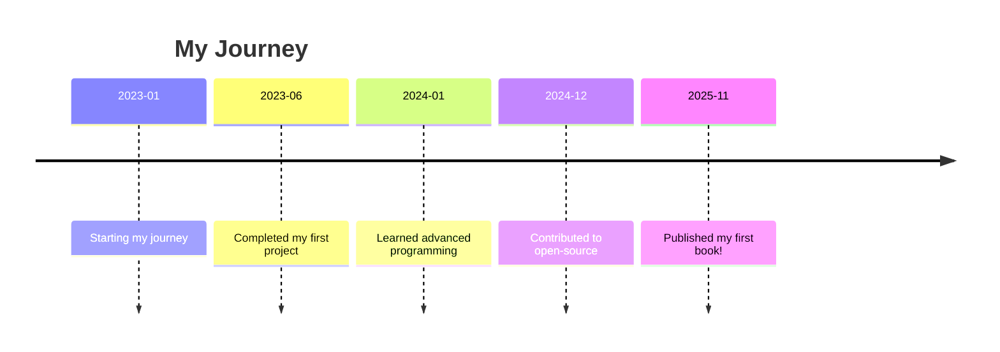

# Interactive Living Resume

## 🎨 ASCII Art
```
 _____  _        _____                _        
|  __ \| |      / ____|              | |       
| |  | | |     | (___   ___ _ __ ___ | |_ ___  
| |  | | |      \___ \ / _ \ '_ ` _ \| __/ _ \ 
| |__| | |____  ____) |  __/ | | | | | || (_) |
|_____/|______|_____/  \___|_| |_| |_|\__\___/ 
```

## 🎮 Code Challenge Game
```python
def number_guessing_game():
    import random
    number_to_guess = random.randint(1, 100)
    attempts = 0
    print("Guess the number between 1 and 100!")

    while True:
        guess = int(input("Enter your guess: "))
        attempts += 1
        if guess < number_to_guess:
            print("Too low!")
        elif guess > number_to_guess:
            print("Too high!")
        else:
            print(f"Congratulations! You've guessed the number in {attempts} attempts.")
            break

number_guessing_game()
```

## 📊 Mermaid Timeline


## 🥇 Fit Score Calculator
```python
def fit_score_calculator(weight, height):
    bmi = weight / (height ** 2)
    if bmi < 18.5:
        return "Underweight"
    elif 18.5 <= bmi < 24.9:
        return "Normal weight"
    elif 25 <= bmi < 29.9:
        return "Overweight"
    else:
        return "Obesity"
```

## 🧩 Project Cards
| Project           | Description                       | Status       |
|-------------------|-----------------------------------|--------------|
| Awesome Project   | A project that does awesome things| In Progress  |
| Fun Library       | A library that helps in doing fun | Completed     |

## 📈 Learning Progress Table
| Topic             | Progress (%) |
|-------------------|--------------|
| Python Basics     | 100%         |
| Data Structures   | 75%          |
| Web Development    | 50%         |

## 💬 Developer Philosophy
> "Code is like humor. When you have to explain it, it’s bad." – Cory House

## 📰 Fun Facts
- I love learning new languages.
- I have a pet parrot named Codey.
- I enjoy hiking and nature photography.
