<div align="center">

# 🚀 Samuel Baraka

```ascii
╔═══════════════════════════════════════════════════════════╗
║  Full-Stack Developer • Problem Solver • Code Craftsman  ║
╚═══════════════════════════════════════════════════════════╝
```

**📍 Nairobi, Kenya** • **🌐 Building the Future, One Commit at a Time**

[](https://git.io/typing-svg)

</div>

---

## 🎮 Try Before You Hire

<details>
<summary><b>🕹️ Click to Play: "Debug My Code" Challenge</b></summary>

```javascript
// Find the bug in this React Hook and win my contact info! 🎯
function useCounter() {
  const [count, setCount] = useState(0);
  
  useEffect(() => {
    const timer = setInterval(() => {
      setCount(count + 1);  // 🐛 Bug is here!
    }, 1000);
  }, []);
  
  return count;
}

// Fix it and tweet @the_samdev652 with #DebuggedSam for a surprise!
```

<details>
<summary>💡 Hint</summary>

The dependency array is missing something important...

</details>

<details>
<summary>✅ Solution</summary>

```javascript
// Fixed version:
useEffect(() => {
  const timer = setInterval(() => {
    setCount(prev => prev + 1);  // Use functional update!
  }, 1000);
  
  return () => clearInterval(timer);  // Don't forget cleanup!
}, []);
```

**Now you know I know my stuff. Let's talk!** 📧 sambaraks652@gmail.com

</details>

</details>

---

## 🗺️ My Developer Journey

```mermaid
timeline
    title From Curiosity to Mastery
    2021 : Started with HTML/CSS
         : Built first static website
    2022 : Learned JavaScript
         : First React app
         : Discovered Django
    2023 : TypeScript conversion
         : First production app
         : 1000+ GitHub contributions
    2024 : AWS deployment
         : Microservices architecture
         : Mentoring developers
    2025 : System design mastery
         : Open source maintainer
         : YOU HIRE ME? 🚀
```



---

## 🎯 Tech Stack Compatibility

**Your Role → My Fit Score**

```python
def calculate_fit(job_requirements):
    my_skills = {
        'react': 95, 'typescript': 90, 'nextjs': 88,
        'python': 92, 'django': 85, 'nodejs': 80,
        'aws': 78, 'docker': 82, 'postgresql': 88,
        'system_design': 75, 'testing': 85
    }
    
    match_score = sum(
        my_skills.get(skill, 0) 
        for skill in job_requirements
    ) / len(job_requirements)
    
    return f"{match_score}% Match! Let's talk 🤝"

# Try it:
print(calculate_fit(['react', 'typescript', 'aws']))  
# Output: "91% Match! Let's talk 🤝"
```

---

## 💼 Portfolio Highlights

<table>
<tr>
<td width="50%">

### 🛒 E-Commerce Platform
**Real-time inventory • Payment processing**

```typescript
// Tech Stack
const project = {
  frontend: ['Next.js 14', 'TypeScript', 'TailwindCSS'],
  backend: ['Django', 'PostgreSQL', 'Redis'],
  cloud: ['AWS EC2', 'S3', 'CloudFront'],
  metrics: {
    users: '10K+ daily',
    performance: '<2s load time',
    uptime: '99.9%'
  }
};
```

**Impact:** Converted 35% more visitors to customers

</td>
<td width="50%">

### 📊 SaaS Dashboard
**Multi-tenant • Real-time collaboration**

```typescript
// Architecture Highlight
interface AppArchitecture {
  auth: 'JWT + OAuth2.0',
  realtime: 'WebSockets',
  state: 'Redux Toolkit + RTK Query',
  rbac: 'Role-Based Access Control',
  deployment: 'Docker + GitHub Actions'
}
```

**Impact:** 40% faster team coordination

</td>
</tr>
<tr>
<td width="50%">

### ☁️ Cloud Infrastructure
**Automated deployment workflows**

```yaml
# CI/CD Pipeline
deploy:
  - build: Docker containers
  - test: Automated testing suite
  - deploy: Blue-green deployment
  - monitor: CloudWatch + Alerts
```

**Impact:** 85% fewer deployment errors

</td>
<td width="50%">

### 🤖 API Microservices
**Scalable backend architecture**

```python
# Django REST Framework
class HighPerformanceAPI:
    cache = Redis()
    rate_limit = "1000/hour"
    auth = "JWT"
    
    def handle_request(self):
        # Optimized for speed
        return response  # <100ms
```

**Impact:** 1M+ requests/month handled

</td>
</tr>
</table>

---

## 🔥 Live Coding Stats

<div align="center">

```text
TypeScript   12 hrs 40 mins  ████████████░░░░░   48.2%
Python        8 hrs 15 mins  ████████░░░░░░░░░   31.4%
JavaScript    3 hrs 20 mins  ███░░░░░░░░░░░░░░   12.7%
CSS           1 hr 30 mins   █░░░░░░░░░░░░░░░░    5.7%
Other         32 mins        ░░░░░░░░░░░░░░░░░    2.0%
```


</div>

---

## 🧠 What I'm Learning Right Now

<div align="center">

| 📚 Topic | 📈 Progress | 🎯 Goal |
|---------|------------|--------|
| System Design Patterns | ████████░░ 80% | Build scalable architectures |
| AWS Solutions Architect | ██████░░░░ 60% | Professional certification |
| Rust Programming | ████░░░░░░ 40% | High-performance backends |
| Machine Learning Basics | ███░░░░░░░ 30% | AI-powered features |

</div>

---

## 🎨 My Development Philosophy

```javascript
class Developer {
  constructor(name) {
    this.name = name;
    this.principles = [
      'Code is written for humans first, computers second',
      'Optimize for maintainability, not cleverness',
      'Test early, test often, sleep peacefully',
      'Ship fast, learn faster, iterate always'
    ];
  }
  
  async solveProblems(problem) {
    // 1. Understand deeply
    const requirements = await this.analyze(problem);
    
    // 2. Design thoughtfully
    const solution = this.architect(requirements);
    
    // 3. Build iteratively
    const product = await this.develop(solution);
    
    // 4. Test rigorously
    await this.test(product);
    
    // 5. Deploy confidently
    return this.ship(product);
  }
}

const sam = new Developer('Samuel Baraka');
```

---

## 📊 GitHub Performance Dashboard

<div align="center">


</div>

---

## 🛠️ Tech Arsenal

<div align="center">

### Frontend Mastery


### Backend Power


### Cloud & DevOps


</div>

---

## 💡 Fun Facts About Me

```python
sam_facts = {
    'location': '🇰🇪 Nairobi, Kenya (EAT timezone)',
    'coffee_consumption': '☕ ~4 cups/day (premium fuel)',
    'debugging_style': '🦆 Rubber duck debugging expert',
    'favorite_quote': '"Make it work, make it right, make it fast" - Kent Beck',
    'currently_listening': '🎵 Lo-fi beats while coding',
    'side_quest': '🎮 Building a game with React + Canvas API',
    'code_motto': '💻 Write code that your future self will thank you for',
    'timezone': 'UTC+3 (but code knows no time zones)',
}

# Pro tip: I respond faster to interesting problems than to "Hello" 😄
print(sam_facts['code_motto'])
```

---

## 🤝 Let's Connect & Build Something Amazing

<div align="center">

[](mailto:sambaraks652@gmail.com)
[](https://twitter.com/the_samdev652)
[](https://linkedin.com/in/samuelbaraka)
[](https://dev.to/unpluggedalpha)
[](https://leetcode.com/u/simplesam/)
[](https://stackoverflow.com/users/24487987/sam-dev652)

</div>

---

## 🎯 What I'm Looking For

```typescript
interface IdealOpportunity {
  role: 'Senior Software Engineer' | 'Full-Stack Developer' | 'Technical Lead';
  stack: ['React', 'TypeScript', 'Python', 'AWS'];
  culture: {
    learning: 'continuous',
    innovation: 'encouraged',
    workLifeBalance: 'respected',
    impactful: true
  };
  remote: 'yes' | 'hybrid';
  challenges: 'bring them on! 💪';
}

// If this matches your company, let's talk!
const letsTalk = () => window.location.href = 'mailto:sambaraks652@gmail.com';
```

---

<div align="center">

### 🚀 Why Work With Me?

✅ **Fast Learner** – Pick up new technologies quickly and apply them effectively  
✅ **Problem Solver** – Love tackling complex challenges with elegant solutions  
✅ **Team Player** – Mentor junior devs and collaborate cross-functionally  
✅ **Quality Focused** – Write clean, tested, maintainable code  
✅ **Business Minded** – Understand that code serves business goals  
✅ **Communicator** – Explain technical concepts to non-technical stakeholders  

---

### 📈 GitHub Insights


**Response Time:** Usually < 24 hours ⚡

---

<sub>**Last updated:** November 2025 via GitHub Actions</sub>

**Built with 💙 by Sam** • *Inspired by curiosity, powered by code*

### 💬 "The best way to predict the future is to build it."

</div>
